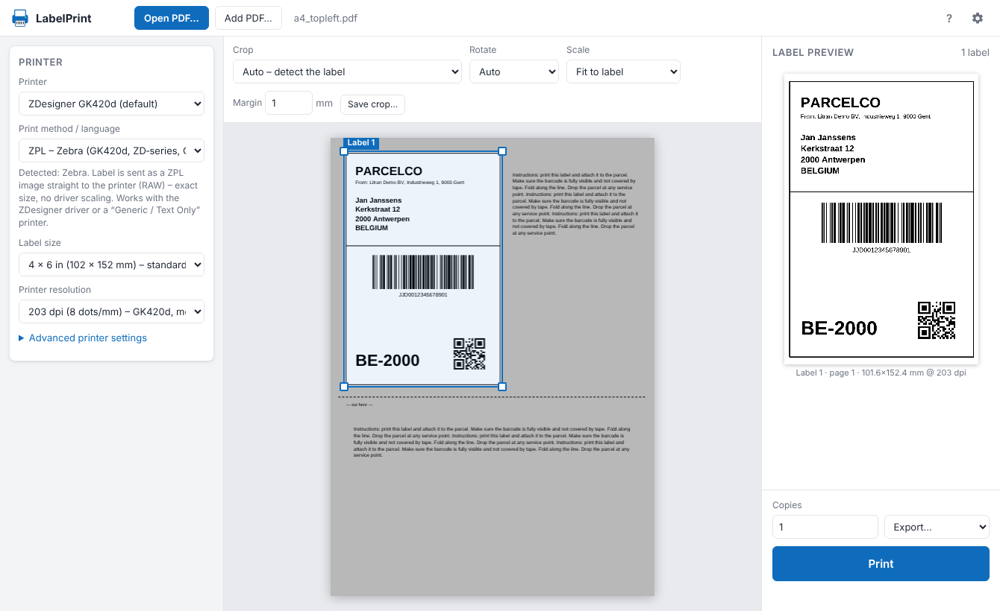
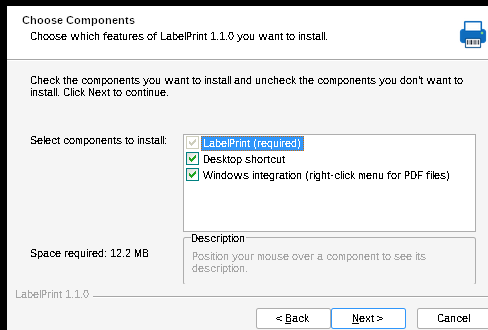
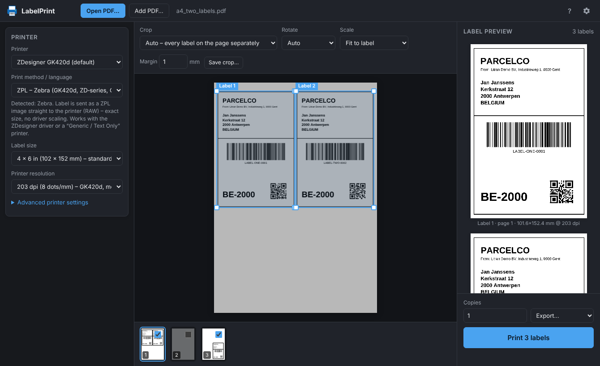
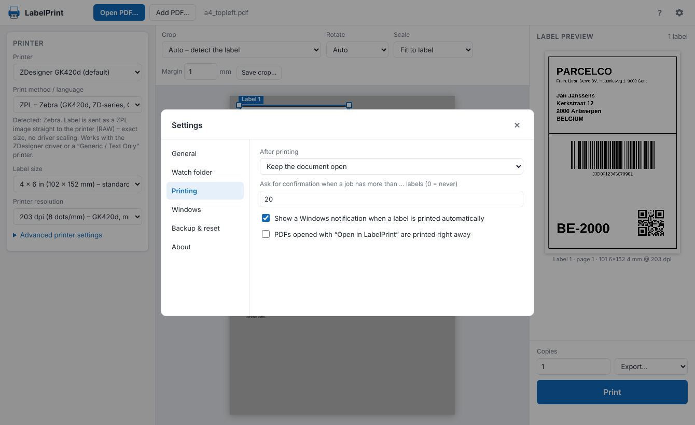

<div align="center">


# LabelPrint

**Print shipping labels from A4/Letter PDFs straight to your thermal label printer, already cropped, rotated and sized to fit.**

[](https://github.com/jonasvdvbe/labelprint/releases/latest)


[](LICENSE)



</div>

---

Webshops and carriers (bpost, PostNL, DHL, DPD, UPS, GLS, Amazon, Bol, Vinted…) usually give you the shipping label as an **A4 PDF** with the label in one corner, surrounded by instructions and cut lines. Printing that on a 4×6″ label printer gives you a tiny, unreadable label, or you end up cropping it by hand every time.

**LabelPrint finds the label on the page, crops it, rotates it and scales it to your label size, then sends it to the printer in the printer's own language** (ZPL, EPL or TSPL). With these RAW languages there's no driver scaling and no margins, so barcodes stay sharp.

## ✨ Features

- 🔍 **Automatic label detection**: finds framed and frameless labels and ignores instruction text and dashed cut lines
- 🧩 **Multiple labels per page**: splits a page with 2–4 labels into separate labels; empty pages are skipped
- ✂️ **Manual crop & presets**: drag a rectangle (move it, resize it from the corners) and save it as a named preset per carrier
- 🔄 **Auto-rotate & fit**: landscape labels are turned to fit portrait label stock; fit-to-label or 100% actual size
- 🖨️ **Direct RAW printing**: ZPL, EPL2 and TSPL go straight to the spooler or to a network printer (port 9100)
- 🏷️ **Every brand**: anything else (Dymo, Brother, Rollo…) prints through its normal Windows driver
- 👀 **What you see is what prints**: the preview is the exact 1-bit bitmap that's sent to the printer
- 📂 **Watch folder**: new PDFs in e.g. *Downloads* open and print automatically, optionally only when the filename matches
- 🖱️ **Explorer integration**: *Open in LabelPrint* and *Print label* in the right-click menu of every PDF, plus "Open with"
- ⚙️ **Settings for the details**: darkness, speed, media type, offsets, 180° flip, threshold or dithering, calibration, test label
- 🌗 **Light & dark theme**, export/import of settings, notifications for automatic prints
- 📦 **One small exe**: no .NET, Java or Python needed; per-user installer, no admin rights required

## 📥 Download & install

Download the latest release from the [**Releases page**](https://github.com/jonasvdvbe/labelprint/releases/latest):

| File | Use |
|---|---|
| `LabelPrint-Setup-x.y.z.exe` | **Recommended.** Per-user installer with Start menu entry, optional desktop shortcut and optional right-click menu |
| `LabelPrint.exe` | Portable version. Download it and run it, nothing gets installed |



The installer **does not need administrator rights** and does not change your default PDF viewer. You can uninstall it from *Settings → Apps*.

> [!NOTE]
> The binaries are not code-signed (yet), so Windows SmartScreen may show *"Windows protected your PC"*. Click **More info → Run anyway**.

<br clear="right">

## 🚀 Quick start (Zebra GK420d example)

1. Start **LabelPrint** and choose your printer, e.g. **ZDesigner GK420d**. The print method is set to **ZPL** automatically.
2. Pick the label size (**4 × 6 in / 102 × 152 mm**) and resolution (**203 dpi**).
3. Drag a shipping-label PDF onto the window, or click **Open PDF…**.
4. Check the preview on the right and press **Print** (<kbd>Ctrl</kbd>+<kbd>P</kbd>).

Labels drifting or blank labels coming out between prints? Open **Advanced printer settings** and click **Calibrate media**, or set *Media* to *Labels with gap*.

## 🖨️ Supported printers

| Method | Printers | How |
|---|---|---|
| **ZPL** | Zebra GK420d/GX420d, ZD220/230/410/420/421/620, ZT-series, and any printer with ZPL emulation (Honeywell, TSC, Citizen, …) | RAW to spooler |
| **EPL2** | Older Zebra / Eltron LP 2844, TLP 2844, LP 2824 | RAW to spooler |
| **TSPL** | TSC, Xprinter, Munbyn, iDPRT, HPRT, Polono, Jadens, Beeprt, … | RAW to spooler |
| **Windows driver** | Every printer: Dymo LabelWriter, Brother QL/TD, Rollo, Sato, Godex, Bixolon, … | GDI through the installed driver |
| **Network** | Any ZPL/EPL/TSPL printer with an IP address | RAW over TCP port 9100 |

The print method is suggested from the driver name and you can always change it. Settings are remembered **per printer**.

> [!TIP]
> In *Windows driver* mode, set the label size in the printer's **Printing preferences** so it matches the size in LabelPrint.

## 📸 More screenshots

<table>
<tr>
<td></td>
<td></td>
</tr>
<tr>
<td align="center"><sub>Two labels on one A4 page, detected separately (dark theme)</sub></td>
<td align="center"><sub>Settings behind the cog icon</sub></td>
</tr>
</table>

## 🤖 Automation

**Watch folder** (*Settings → Watch folder*): point it at your *Downloads* folder, optionally with a name filter such as `label|etiket|verzend|shipment`, and tick *Print them immediately*. Every label you download then prints by itself while LabelPrint is open.

**Right-click menu** (installer option or *Settings → Windows*): adds two entries for PDFs.

- *Open in LabelPrint* opens the PDF for review.
- *Print label (LabelPrint)* prints immediately with the last-used printer and crop settings. It also works with several PDFs selected at once.

**Command line**

```bat
LabelPrint.exe label.pdf            :: open a PDF
LabelPrint.exe --print label.pdf    :: print immediately with the last-used settings
```

Only one instance runs at a time; new files are handed to the window that's already open.

## 🛠️ How it works

```
┌──────────────────────── LabelPrint.exe (Go, single binary) ────────────────────────┐
│                                                                                     │
│  Embedded web UI (HTML/JS)                     Go backend (127.0.0.1 only, token)   │
│  ─────────────────────────                     ──────────────────────────────────   │
│  pdf.js renders the PDF page      ──fetch──▶   • list printers (winspool)           │
│  label detection (connected                    • RAW print: ZPL / EPL / TSPL        │
│    components + frame finding)                 • GDI print through the driver       │
│  crop → rotate → scale → 1-bit                 • TCP 9100 network printing          │
│  ZPL (^GFA, ACS-compressed) /                  • config, watch folder, single       │
│    EPL (GW) / TSPL (BITMAP)                       instance, Explorer integration    │
│                                                                                     │
└──────────── shown in a chromeless Microsoft Edge "app" window (built into Windows) ─┘
```

- **Why a web UI?** It's fast to build, looks native and renders PDFs with pdf.js, and the exe still needs no runtime because Microsoft Edge is part of Windows.
- **Why RAW printing?** Sending the label as a printer-language bitmap at the printer's native resolution avoids driver scaling, margins and blurry barcodes.
- **Privacy:** everything runs locally and PDFs never leave your PC. The local server only listens on `127.0.0.1` and requires a random per-session token.

## 🧑‍💻 Building from source

Requirements: **Go 1.22+**. No other Go dependencies (only the standard library), and you can build on Windows, Linux or macOS.

```bash
git clone https://github.com/jonasvdvbe/labelprint.git
cd labelprint

# Windows executable (cross-compiles from any OS)
GOOS=windows GOARCH=amd64 CGO_ENABLED=0 \
  go build -trimpath -ldflags "-H windowsgui -s -w" -o dist/LabelPrint.exe .

# Installer (requires NSIS 3: `apt install nsis` / `choco install nsis`)
makensis installer/LabelPrint.nsi        # → dist/LabelPrint-Setup-x.y.z.exe
```

On PowerShell, set the variables first: `$env:GOOS="windows"; $env:GOARCH="amd64"`.

The exe icon, manifest and version info come from `rsrc_windows_amd64.syso`, which is built from `build/app.rc`:

```bash
x86_64-w64-mingw32-windres --preprocessor=cat -O coff -o rsrc_windows_amd64.syso build/app.rc
```

**Development build (Linux/macOS):** `go run . --no-browser` starts the UI with simulated printers that write their output to `./out`. Open the printed URL in a browser.

### Project structure

```
├── main.go               entry point, single-instance hand-off, flags
├── app.go                HTTP API, config, watch folder, events (SSE)
├── common.go             printer brand → language detection
├── printers_windows.go   winspool RAW, GDI driver printing, Edge window, dialogs
├── shell_windows.go      Explorer right-click integration (HKCU)
├── vendor.go             serves web/vendor.zip under /vendor/
├── printers_other.go     simulated printers for non-Windows development
├── web/
│   ├── index.html, style.css, app.js   user interface
│   ├── labelcore.js      detection, 1-bit conversion, ZPL/EPL/TSPL encoders (no DOM)
│   └── vendor.zip        pdf.js (legacy build) + fonts/cmaps/wasm, served from the zip
├── installer/LabelPrint.nsi   NSIS installer script
├── build/                icon, manifest, version resource
└── docs/                 screenshots
```

## 📄 License

Released under the [MIT License](LICENSE).
Bundles [pdf.js](https://github.com/mozilla/pdf.js) by Mozilla (Apache-2.0); see `PDFJS-LICENSE` inside `web/vendor.zip`.
